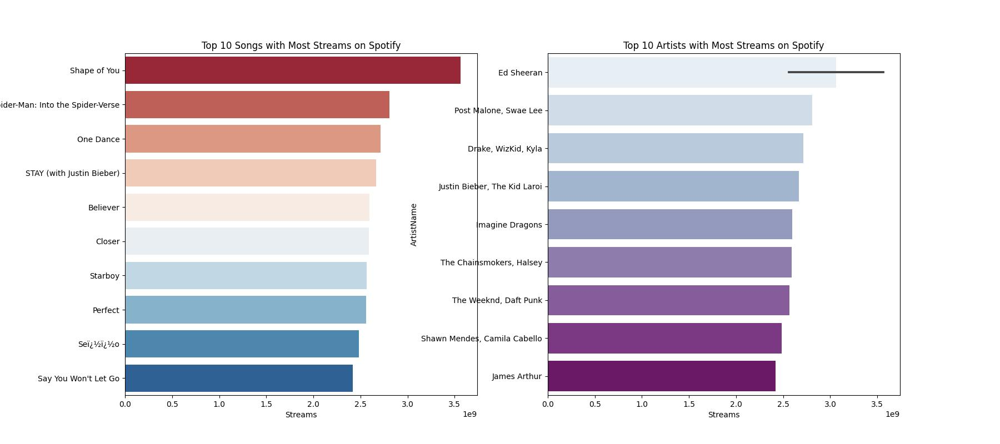
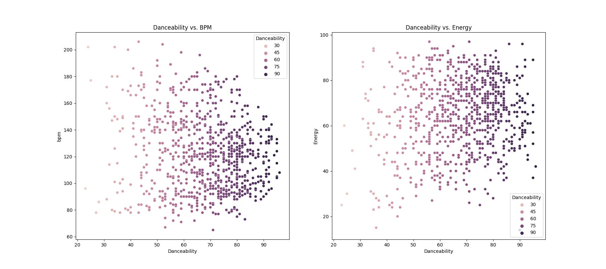
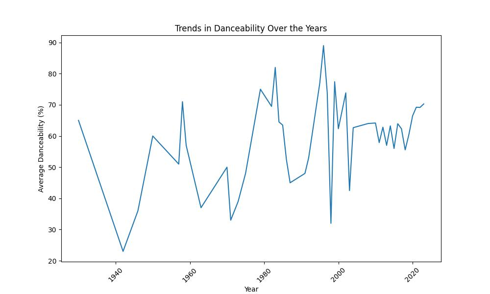

# Spotify

### Table of Contents 

- [Project Overview](#project-overview)
- [Data Sources ](#data-sources)
- [Tools](#tools)
- [Methodology](#methodology)
- [Exploratory Data Analysis](#exploratory-data-analysis)
- [Data Analysis](#data-analysis) 
- [Results Findings](#results-findings)
- [Recommendations](#recommendations)

### Project Overview 

This project is an examination of songs from a Spotify playlist spanning the years 1930 to 2023. The analysis focuses on understanding how various musical attributes influence the danceability of a song and its potential to reach the top of the charts in Spotify playlists.

Key Objectives:

1. Track Analysis by Year:

 - Utilizing SQL queries to explore different track names and their release years, providing insights into the historical context and evolution of music over nearly a century.

2. Feature Correlation and Impact:

 - Investigating the correlation between specific musical features such as energy, beats per minute (BPM), speech, and acoustics—and the danceability of a song.
 - Analyzing how these features may influence a song's likelihood of topping the charts.
  
This project combines historical analysis with data-driven insights, offering a comprehensive look at the evolution of music and the factors that make a song successful.

### Data Sources 

Data: The primary dataset used for this analysis is the "Spotify-2023.csv. This data was retrieved from Kaggle.

### Tools 

- SQLalchemy: For querying and extracting data from the Spotify playlist database, focusing on track names, release years, and various musical features.
- Python: (Pandas, Seaborn, Matplotlib): For data manipulation, analysis, and visualization. Pandas is used for handling and processing the data, while Seaborn and Matplotlib are utilized for creating  visualizations and exploring correlations between features.

### Methodology 
  In the data analysis phase, the following tasks were performed:
  
  1. Data loading and inspection.
  2. Data cleaning and manipulation using Python functions and libraries.
  3. Database integration using SQL, as the dataset was connected to my SQL database.
  4. Used SQL queries to extract relevant data subsets, perform aggregations, and explore the dataset. 
  5. Performed EDA. The extracted data was analyzed to identify trends, patterns, and correlations. This included analyzing the correlation between musical features (e.g., energy, BPM, speech, acoustics) and the danceability of songs.
  6. Used Seaborn and Matplotlib to create various plots and charts for the analysis results. 

### Exploratory Data Analysis

EDA involved exploring the Spotify data to answer key questions such as: 

- How have the characteristics of popular music changed from 1930 to 2023?
- Are there any significant shifts in musical styles or features (e.g., energy, BPM) over time?
- What is the relationship or correlation between energy levels, BPM, speech, acoustics, and the danceability of a song?
- Which musical features are most strongly associated with songs that reach the top of the charts?
- How do these features differ between songs that top the charts and those that don't?

### Data Analysis 
Here are some examples of the visuals from the analyses 

The bar graphs above illustrate the most streamed artists and songs over the past years, including the current year. Notably, despite being released in 2017, Ed Sheeran's song "Shape of You" remains the most streamed track. This highlights the song's enduring popularity and its significant impact on streaming platforms, continuing to outperform more recent releases.

Looking at the following two scatterplots, we can observe the correlation between musical features and the danceability of songs. The first scatterplot displays a negative correlation between BPM (beats per minute) and danceability, indicating that as BPM increases, danceability tends to decrease. Conversely, the second scatterplot shows a positive correlation between energy and danceability, suggesting that higher energy levels in a song are associated with greater danceability. These patterns provide insights into how specific musical attributes influence the appeal of a song for dancing.

The line plot illustrates the trends in danceability over the years, revealing a pattern of fluctuations. There have been periods of both increases and decreases in danceability, indicating that the appeal of danceable music has varied over time. This pattern suggests that cultural shifts, musical trends, and changes in popular genres may have influenced the danceability of songs throughout different eras.

### Results Findings
The analysis results are summarized as follows: 

1. Ed Sheeran's "Shape of You" remains the most streamed song even years after its release in 2017. This indicates its lasting appeal and significant impact on streaming platforms. 
2. Energy vs. Danceability: There is a positive correlation between energy and danceability, meaning that songs with higher energy levels are more danceable.
BPM vs. Danceability: There is a negative correlation between BPM and danceability, suggesting that songs with higher BPMs are generally less danceable.
3. Based on the line plot fluctuating trends danceability trends are influenced by evolving musical styles and cultural shifts.
4. Innovations in music production technology have significantly impacted the characteristics of popular music, influencing features like energy and acoustics.
Also changes in societal norms, musical genres, and cultural movements have also shaped the evolution of music characteristics.

### Recommendations 
Based on the analysis, the following is recommended: 
- Music producers and artists should leverage energy and danceability by focusing on creating high-energy tracks. Given the positive correlation between energy and danceability, higher energy levels are likely to enhance the appeal of dance tracks.
- Continue to feature popular tracks like "Shape of You" that maintain high streaming numbers, as they reflect ongoing listener preferences and engagement.
- Encourage exploration of both traditional and modern music elements. Balancing innovation with established trends can lead to unique and successful music creations.
